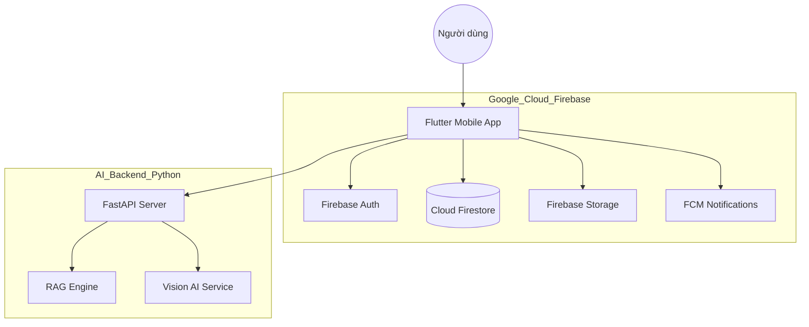
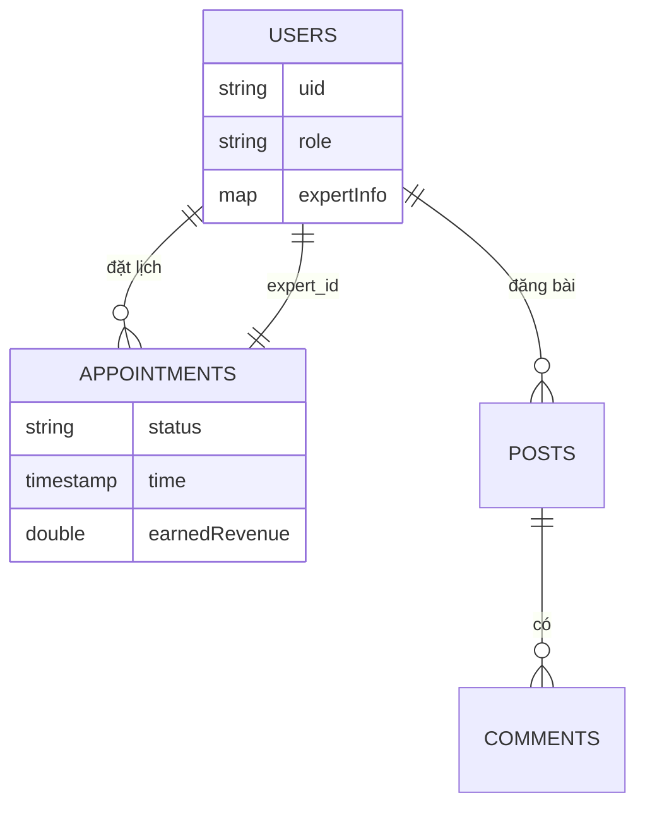

# daklakagent

A new Flutter project for Daklak Agricultural Agent.

---

## 📄 Tài Liệu Kỹ Thuật Toàn Diện Dự Án DaklakAgent
Tài liệu này cung cấp cái nhìn tổng thể và chi tiết về hệ thống "Agent Nông Nghiệp Đắk Lắk", phục vụ cho việc báo cáo, phân tích sâu và đào tạo.

### 📌 Mục lục dự kiến
## 1. TỔNG QUAN DỰ ÁN
- **Tên dự án**: Agent Nông Nghiệp Đắk Lắk (DaklakAgent).
- **Mục tiêu**: Xây dựng một trợ lý ảo thông minh dựa trên AI để hỗ trợ nông dân Đắk Lắk (đặc biệt là vùng trồng sầu riêng và cà phê) trong việc theo dõi thời tiết, quản lý dịch bệnh và kết nối chuyên gia.
- **Bài toán giải quyết**: Thiếu hụt thông tin kỹ thuật chính xác theo thời gian thực và khó khăn trong việc kết nối trực tiếp với các chuyên gia đầu ngành.

## 2. KIẾN TRÚC HỆ THỐNG
Dự án được xây dựng theo mô hình Hiện đại:
- **Frontend**: Flutter (Android/iOS) - Giao diện đồng nhất, hiệu năng cao.
- **Backend (Serverless)**: Firebase Core (Auth, Firestore, Storage, Messaging, Functions).
- **Backend (AI Engine)**: Python Backend (FastAPI) xử lý mô hình ngôn ngữ lớn (LLM) và hệ thống RAG (Retrieval-Augmented Generation).

## 3. PHÂN TÍCH CHỨC NĂNG
- **Dành cho Nông dân**: Trợ lý AI tư vấn kỹ thuật, Dự báo thời tiết thông minh (cảnh báo rủi ro), Diễn đàn cộng đồng, Đặt lịch chuyên gia, Tra cứu sâu bệnh, Nhật ký nông trại.
- **Dành cho Chuyên gia**: Quản lý lịch hẹn tư vấn, Báo cáo & Phân tích hiệu suất (Dashboards), Nhận xét AI về năng lực chuyên môn.

## 4. PHÂN TÍCH SOURCE CODE
Dự án tổ chức theo module (`features-based architecture`):
- `lib/features/ai`: Giao diện chat và dịch vụ gọi API AI.
- `lib/features/auth`: Quản lý xác thực và phân quyền Role-based.
- `lib/features/community`: Quản lý bài đăng và tương tác diễn đàn.
- `lib/features/expret`: Logic báo cáo, thống kê và quản lý lịch hẹn của Chuyên gia.
- `lib/features/home`: Hệ thống điều phối Home và các tiện ích nông nghiệp.
- `lib/features/weather`: Phân tích dữ liệu thời tiết và cảnh báo nấm bệnh/lụt.

## 5. API BACKEND
Các endpoint chính (giao tiếp qua HTTPS/Ngrok):
- **AI Chat**: `POST /chat` - Trả về phản hồi từ LLM dựa trên bộ tri thức nông nghiệp.
- **Weather Analysis**: `GET /api/phan-tich-sau-rieng` - Phân tích rủi ro dựa trên dữ liệu thời tiết thực tế.
- **Expert Insights**: `GET /api/expert-insights/<uid>` - AI phân tích dữ liệu hoạt động của chuyên gia trên Firestore.

## 6. DATABASE (FIRESTORE)
- **`users`**: Lưu thông tin cơ bản, vai trò (farmer/expert), đánh giá và doanh thu (đối với chuyên gia).
- **`appointments`**: Quản lý trạng thái lịch hẹn (pending, confirmed, completed, cancelled).
- **`posts`**: Lưu trữ bài viết, hình ảnh và hashtag cộng đồng.
- **`notifications`**: Hệ thống thông báo đẩy (Push Notifications) đồng bộ realtime.

## 7. GIAO DIỆN (UI/UX)
- **Phong cách**: Glassmorphism (làm mờ nền), sử dụng Gradients xanh lục chủ đạo.
- **Trải nghiệm**: Draggable AI Bot (Robot bay) luôn sẵn sàng hỗ trợ, hệ thống biểu đồ Radar chuyên nghiệp cho chuyên gia.

## 8. USER FLOW
`Đăng nhập` -> `Phân quyền (RoleCheckWrapper)` -> `Trang chủ (Farmer hoặc Expert Dash)` -> `Thực hiện tác vụ (Đặt lịch/Tư vấn)` -> `Hoàn thành & Đánh giá`.

## 9. CÁC TÍNH NĂNG AI
- **RAG System**: Đảm bảo AI chỉ trả lời kiến thức nông nghiệp chính xác đã được thẩm định.
- **Vision AI**: Nhận diện sâu bệnh qua hình ảnh lá/trái cây.
- **Analytics AI**: Biến các con số thô (doanh thu, lượt đánh giá) thành lời khuyên phát triển sự nghiệp cho chuyên gia.

---

## 📖 Hướng dẫn sử dụng (Dành cho Nhà nông)

### 1. Đăng nhập và Khởi tạo
* **Đăng nhập nhanh**: Sử dụng nút **"Tiếp tục với Google"** để truy cập ngay lập tức hoặc sử dụng Email cá nhân để đăng ký.
* **Phân quyền tự động**: Khi đăng ký mới, hệ thống mặc định cấp quyền **Nhà nông** để bạn có thể sử dụng đầy đủ các công cụ hỗ trợ sản xuất.

### 2. Trợ lý AI và Thời tiết Thông minh
* **Hỏi tư vấn AI**: Nhấn vào **biểu tượng Robot bay** (Draggable AI) hoặc thanh tìm kiếm thông minh tại Trang chủ. Bạn có thể hỏi mọi vấn đề kỹ thuật như: *"Làm sao để xử lý sầu riêng bị rụng bông?"* hoặc *"Quy trình bón phân cho cà phê mùa khô"*.
* **Phân tích Thời tiết (Smart Weather)**: Xem thẻ **"Phân Tích Thông Minh AI"** để cập nhật:
  - **Chỉ số rủi ro**: Cảnh báo nguy cơ Lũ lụt, Nấm bệnh và Stress nhiệt (tính theo %).
  - **Kế hoạch hành động**: AI đề xuất danh sách việc cần làm ngay (VD: Ngưng bón đạm khi độ ẩm cao) để bảo vệ cây trồng.

### 3. Bộ Tiện ích Nông nghiệp 4.0
* **Tra cứu & Chăm sóc**: 
  - **Tra cứu sâu bệnh**: Thư viện hình ảnh và giải pháp đặc trị cho các loại cây trồng chủ lực của Đắk Lắk.
  - **Phân tích ảnh bệnh**: Chụp ảnh lá/bông bị bệnh, AI sẽ chẩn đoán và gợi ý thuốc bảo vệ thực vật phù hợp.
  - **Lịch tưới**: Thiết lập kế hoạch tưới nước tự động dựa trên giai đoạn sinh trưởng.
* **Quản lý & Theo dõi**:
  - **Nhật ký nông nghiệp**: Ghi lại lịch bón phân, xịt thuốc để theo dõi chi phí.
  - **Giá nông sản**: Cập nhật giá cà phê, sầu riêng, hồ tiêu... trực tiếp tại thị trường Đắk Lắk.
  - **Diễn đàn**: Đăng bài chia sẻ kinh nghiệm hoặc hỏi đáp cùng cộng đồng bà con.

### 4. Kết nối Chuyên gia
* **Tìm kiếm**: Vào mục **"Đặt Lịch Chuyên Gia"**, lọc theo lĩnh vực chuyên sâu (Sầu riêng, Cà phê, Hồ tiêu...).
* **Đặt lịch**: Xem hồ sơ, đánh giá sao của chuyên gia và chọn giờ trống để đặt lịch tư vấn trực tiếp qua Chat hoặc Video Call.

## 🎓 Hướng dẫn Đăng ký làm Chuyên gia
Trở thành chuyên gia nông nghiệp trên nền tảng để chia sẻ kiến thức, mở rộng tệp khách hàng và tăng thu nhập thông qua tư vấn trực tuyến.

### Bước 1: Đăng nhập và Chuẩn bị hồ sơ
* **Yêu cầu cơ bản**: Bạn cần có tài khoản trên ứng dụng (Đăng nhập qua Google hoặc Email).
* **Chuẩn bị file**: Một bản sao hồ sơ năng lực (CV/Portfolio) định dạng **PDF** hoặc **Doc** liệt kê kinh nghiệm làm việc, bằng cấp và hình ảnh vườn mẫu/dự án đã tham gia.

### Bước 2: Nộp đơn Đăng ký
1. Từ **Trang cá nhân** (tab cuối cùng ở Bottom Navigation) hoặc nút "Trở thành chuyên gia" ở trang chủ, chọn **Đăng ký Chuyên gia**.
2. **Điền thông tin form**:
   - **Thông tin liên hệ**: Họ và tên, số điện thoại.
   - **Chuyên môn chính**: Chọn lĩnh vực thế mạnh nhất (Ví dụ: Sầu riêng, Cà phê, Hồ tiêu...).
   - **Kinh nghiệm**: Điền nơi công tác hiện tại, kỹ năng nổi bật (VD: Kỹ thuật xử lý ra hoa nghịch vụ) và mô tả ngắn gọn về bản thân.
3. Bấm **tải lên** và đính kèm file hồ sơ năng lực đã chuẩn bị.
4. Bấm **"GỬI HỒ SƠ"**. Hệ thống sẽ thông báo ghi nhận thành công.

### Bước 3: Phê duyệt và Sử dụng Expert Dashboard
* **Quá trình duyệt**: Ban quản trị sẽ đối chiếu thông tin và liên hệ qua điện thoại nếu cần. Sau khi được duyệt, trạng thái tài khoản của bạn trên Firebase sẽ được chuyển từ `farmer` sang `expert`.
* **Sử dụng Bảng điều khiển Chuyên gia (Expert Dashboard)**:
   - **Quản lý lịch hẹn**: Tab "Chờ Duyệt" hiển thị các yêu cầu mới. Tab "Đã Nhận" quản lý các ca tư vấn sắp tới.
   - **Đánh dấu Hoàn thành**: Sau mỗi ca tư vấn, chuyên gia nhập doanh thu và hình ảnh xác nhận để hệ thống ghi nhận vào báo cáo.
   - **Phân tích Hiệu suất**: Truy cập mục **"Báo Cáo & Phân Tích"** để xem biểu đồ Radar đánh giá 5 chỉ số (Khối lượng, Thành công, Doanh thu, Khách quen, Đánh giá).
   - **AI Insights**: Nhận lời khuyên cá nhân hóa từ AI dựa trên dữ liệu hoạt động thực tế để tối ưu hóa thu nhập và chất lượng dịch vụ.

---

## 💬 Diễn đàn và Kết nối Cộng đồng
* **Chia sẻ kiến thức**: Nông dân và Chuyên gia có thể đăng bài viết kèm hình ảnh thực tế từ vườn.
* **Hashtag thông minh**: Sử dụng các hashtag (VD: #saurieng, #caphe, #benhla) để phân loại và giúp người khác dễ dàng tìm kiếm thông tin liên quan.
* **Tương tác**: Bình luận và giải đáp thắc mắc trực tiếp trên các bài đăng để xây dựng uy tín cá nhân lành mạnh.

## 🔔 Hệ thống Thông báo và Trạng thái (Real-time)
* **Thông báo Push (FCM)**: Bạn sẽ nhận được thông báo ngay lập tức khi:
   - Có yêu cầu đặt lịch mới (đối với Chuyên gia).
   - Lịch hẹn được xác nhận hoặc có tin nhắn mới.
   - Các cảnh báo thời tiết/thiên tai khẩn cấp.
* **Trạng thái Hoạt động (Presence)**: Hệ thống hiển thị trạng thái **Online/Offline** giúp người dùng biết được chuyên gia nào đang sẵn sàng tư vấn trực tuyến để tăng khả năng kết nối thành công.

---
## 4. KIẾN TRÚC HỆ THỐNG & MÔ HÌNH DỮ LIỆU

### 4.1. Kiến trúc tổng thể
Hệ thống được thiết kế theo kiến trúc Cloud-Native:

### 4.2. Mô hình thực thể (ERD rút gọn)
Dữ liệu được quản lý đồng nhất trên Firebase:

## 5. CÔNG NGHỆ & ĐỘ KHÓ KỸ THUẬT (10đ)
- **Frontend**: Flutter SDK, Material 3 (UI Glassmorphism), fl_chart.
- **Backend Cloud**: Firebase (Authentication, NoSQL Firestore, Messaging).
- **AI Core (Python)**: FastAPI, LangChain (RAG), Transformers.
- **Bảo mật**: Xác thực Google, Phân quyền người dùng (Security Rules), Ngrok Secure Tunneling.

## 6. HÀM LƯỢNG AI & ĐIỂM THƯỞNG (Khuyến khích)
Sản phẩm tích hợp các kỹ thuật trí tuệ nhân tạo đột phá:
- **AI RAG (Knowledge Consultant)**: Chuyên gia ảo trả lời câu hỏi dựa trên bộ dữ liệu tri thức nông nghiệp Đắk Lắk được thẩm định.
- **Smart Weather AI Analysis**: Phân tích dữ liệu thời tiết để dự báo rủi ro stress nhiệt và nấm bệnh trên sầu riêng.
- **Expert Analytics AI**: Tự động đánh giá hiệu suất của chuyên gia qua biểu đồ Radar và đưa ra lời khuyên cải thiện kỹ năng.

## 7. DEMO SẢN PHẨM & KẾT QUẢ ĐẠT ĐƯỢC (10đ)
- **Giao diện**: Hiện đại, mượt mà (60 FPS), bố cục hợp lý cho cả 2 vai trò Farmer/Expert.
- **Độ ổn định**: Xử lý dữ liệu Realtime, cập nhật trạng thái Online/Offline tức thì.
- **Triển khai**: Đã sẵn sàng chạy môi trường test với Firebase và AI Backend.

---
**Nhóm thực hiện**: Sinh viên Khoa Công nghệ Thông tin - Trường ĐH Nguyễn Tất Thành
**Hướng phát triển**: Tích hợp IoT giám sát vườn và hoàn thiện tính năng xuất báo cáo Excel cho chuyên gia.
*Tài liệu được cập nhật tự động bởi Antigravity AI - Hỗ trợ phân tích hệ thống DaklakAgent.*
